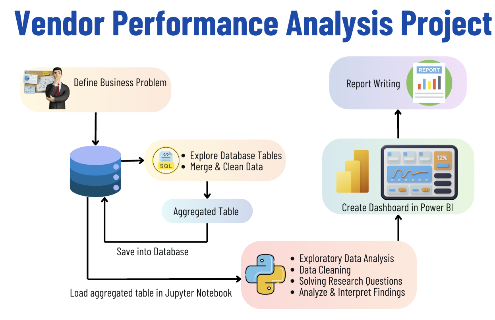

# 📊 Retail Vendor Performance & Inventory Optimization Analysis

## 🎯 Business Problem
Effective inventory and sales management are critical for optimizing profitability in the retail and wholesale industry. However, companies often face challenges such as inefficient pricing, poor inventory turnover, and over-dependence on specific vendors, which can lead to financial losses and reduced operational efficiency.

### 🔍 Objectives of the Analysis

- Identify underperforming brands that require promotional or pricing adjustments  
- Determine top vendors contributing to overall sales and gross profit  
- Analyze the impact of bulk purchasing on unit costs  
- Assess inventory turnover to reduce holding costs and improve efficiency  
- Investigate profitability differences between high-performing and low-performing vendors
  
## 🔄 Project Workflow

The project follows a structured end-to-end data analysis pipeline:

## ⚙️ Approach

The project follows a structured, end-to-end data analytics pipeline:

### 1. Data Ingestion
- Loaded raw datasets (purchases, sales, inventory, vendor invoices) into a SQL database  
- Automated ingestion using Python script: `scripts/ingestion_db.py`  
- Ensured efficient data loading and structured storage for further analysis

### 2. Data Transformation & Aggregation
- Merged multiple datasets (purchases, sales, vendor invoices) using SQL joins and CTEs  
- Created an aggregated vendor-level summary table  
- Calculated total sales, purchase cost, and freight cost for each vendor  
- Implemented using [get_vendor_summary.py](scripts/get_vendor_summary.py)

### 3. Data Cleaning & KPI Engineering
- Handled missing values and ensured data consistency  
- Standardized data formats and removed unwanted spaces  
- Converted data types for accurate analysis  

- Engineered key business KPIs:
  - Gross Profit  
  - Profit Margin (%)  
  - Stock Turnover  
  - Sales-to-Purchase Ratio  

- Implemented using [get_vendor_summary.py](scripts/get_vendor_summary.py)

### 4. Data Analysis & Visualization

  
