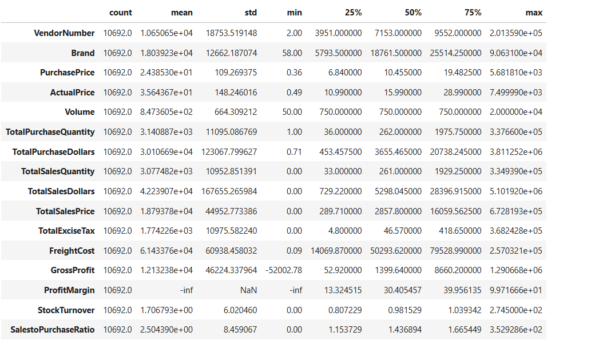
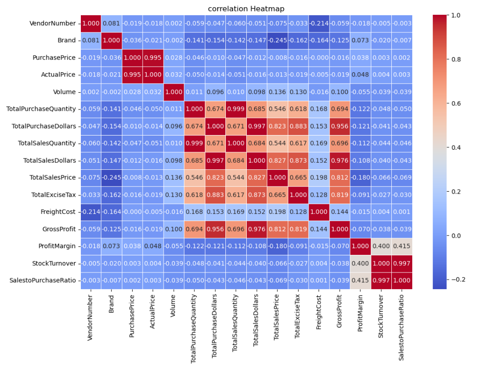
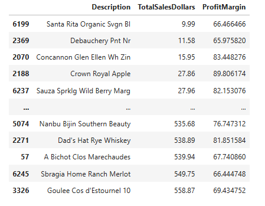
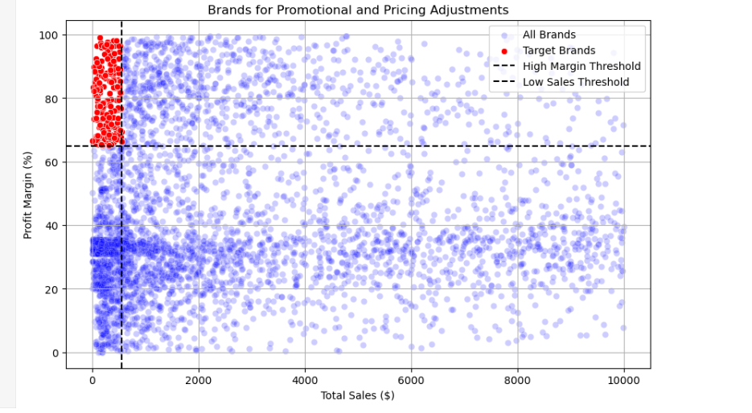
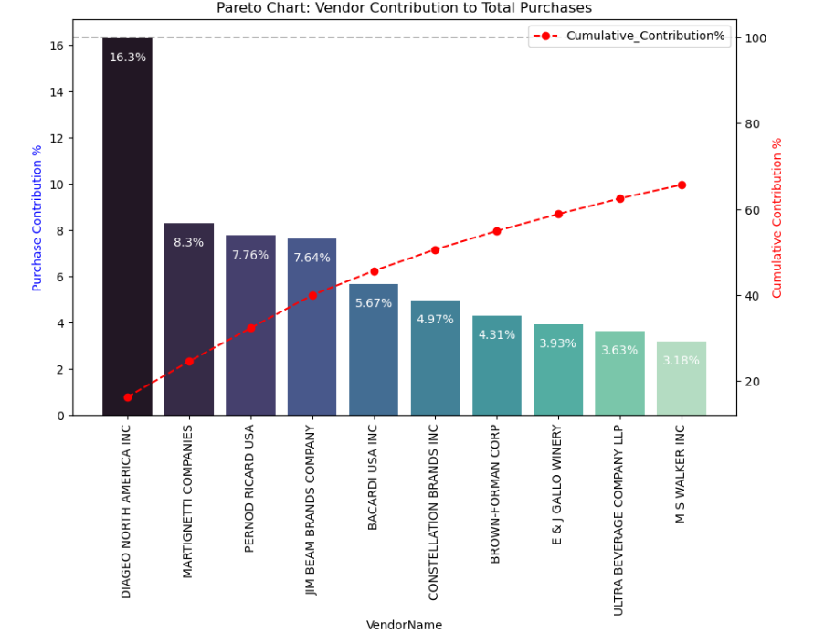

# 📊 Retail Vendor Performance & Inventory Optimization Analysis

## 🎯 Business Problem
Effective inventory and sales management are critical for optimizing profitability in the retail and wholesale industry. However, companies often face challenges such as inefficient pricing, poor inventory turnover, and over-dependence on specific vendors, which can lead to financial losses and reduced operational efficiency.

### 🔍 Objectives of the Analysis

- Identify underperforming brands that require promotional or pricing adjustments  
- Determine top vendors contributing to overall sales and gross profit  
- Analyze the impact of bulk purchasing on unit costs  
- Assess inventory turnover to reduce holding costs and improve efficiency  
- Investigate profitability differences between high-performing and low-performing vendors
  
## 🔄 Project Workflow

The project follows a structured end-to-end data analysis pipeline:

## ⚙️ Approach

The project follows a structured, end-to-end data analytics pipeline:

### 1. Data Ingestion
- Loaded raw datasets (purchases, sales, inventory, vendor invoices) into a SQL database  
- Automated ingestion using Python script: `scripts/ingestion_db.py`  
- Ensured efficient data loading and structured storage for further analysis

### 2. Data Transformation & Aggregation
- Merged multiple datasets (purchases, sales, vendor invoices) using SQL joins and CTEs  
- Created an aggregated vendor-level summary table  
- Calculated total sales, purchase cost, and freight cost for each vendor  
- Implemented using [get_vendor_summary.py](scripts/get_vendor_summary.py)

### 3. Data Cleaning & KPI Engineering
- Handled missing values and ensured data consistency  
- Standardized data formats and removed unwanted spaces  
- Converted data types for accurate analysis  

- Engineered key business KPIs:
  - Gross Profit  
  - Profit Margin (%)  
  - Stock Turnover  
  - Sales-to-Purchase Ratio  

- Implemented using [get_vendor_summary.py](scripts/get_vendor_summary.py)

### 4. Data Analysis & Visualization

## 📊 Key Insights

### 🔴 1. Negative Profit & Loss Cases
- Gross Profit shows negative values (minimum: -52,002.78), indicating some products are sold at a loss  
- This may be due to heavy discounts or high purchase costs  
- Profit Margin shows extreme negative values when sales revenue is zero or very low  

👉 Business Impact:  
Loss-making products need pricing correction or cost optimization  

---

### 📦 2. Unsold & Slow-Moving Inventory
- Some products have zero sales despite being purchased  
- Indicates unsold or slow-moving inventory  

👉 Business Impact:  
Leads to higher holding costs and inefficient inventory management  

---

### 📊 3. Outliers in Pricing
- Purchase Price and Actual Price show extreme maximum values compared to the average  
- Suggests presence of premium or high-value products  

👉 Business Impact:  
Requires segmentation strategy (premium vs regular products)  

---

### 🚚 4. Freight Cost Variability
- Freight cost varies significantly (from 0.09 to 257,032.07)  
- Indicates inconsistent logistics or bulk shipments  

👉 Business Impact:  
Opportunity to optimize shipping and reduce logistics costs  

---

### 🔄 5. Stock Turnover Insights
- Stock turnover ranges from 0 to 274.5  
- Some products sell very fast, while others remain unsold  

👉 Business Impact:  
Need better demand forecasting and inventory planning  

---

### ⚠️ 6. Data Filtering Decisions
- Removed:
  - Negative profit transactions  
  - Profit margin ≤ 0  
  - Zero sales records  

👉 Business Impact:  
Improved reliability and focus on meaningful analysis  

### 📊 6. Correlation Insights

- **Purchase Price vs Sales & Profit**
  - Weak correlation (-0.012, -0.016)  
  👉 Price changes do not significantly impact sales revenue or profit  

- **Total Purchase Quantity vs Total Sales Quantity**
  - Strong positive correlation (0.999)  
  👉 Indicates efficient inventory flow and strong demand alignment  

- **Profit Margin vs Sales Price**
  - Negative correlation (-0.179)  
  👉 Increasing selling price may reduce profit margins due to competitive pressure  

- **Stock Turnover vs Profitability**
  - Weak negative correlation (-0.038, -0.055)  
  👉 Faster inventory movement does not always result in higher profit  

## 🎯 Research Question 1: Brands for Promotional or Pricing Adjustments

### 📊 Brands with Low Sales but High Profit Margins

- Identified brands that have **high profit margins but low sales volume**  
- These products are profitable but not selling enough  

👉 Business Insight:  
These brands have strong profit potential but lack visibility or demand  

---

### 📈 Visual Analysis

- Highlighted region shows products with:
  - High Profit Margin  
  - Low Sales  

👉 Business Insight:  
These products are ideal candidates for:
- Promotions  
- Marketing campaigns  
- Pricing strategy adjustments  

---

### 💼 Recommendation

- Increase marketing efforts for these brands  
- Offer targeted discounts or bundles  
- Improve product visibility  

> This can significantly increase revenue without sacrificing profitability

## 📊 Vendor Contribution Analysis (Pareto Analysis)

### 🔍 Key Observations

- A small number of vendors contribute a **large percentage of total purchases**  
- **DIAGEO NORTH AMERICA INC** alone contributes ~16%  
- Top 3–5 vendors contribute a **significant share of total procurement value**  

👉 This follows the **80/20 Pareto Principle** (few vendors drive most business)

---

### 💡 Business Insights

- High dependency on a few vendors increases **business risk**  
- Any disruption from top vendors can heavily impact operations  
- Indicates **supplier concentration**

---

### 💼 Recommendations

- Diversify vendor base to reduce dependency risk  
- Strengthen relationships with top-performing vendors  
- Negotiate better pricing with high-contribution vendors  
- Identify and promote mid-level vendors to balance supply  

> Optimizing vendor distribution can improve cost efficiency and reduce operational risk

